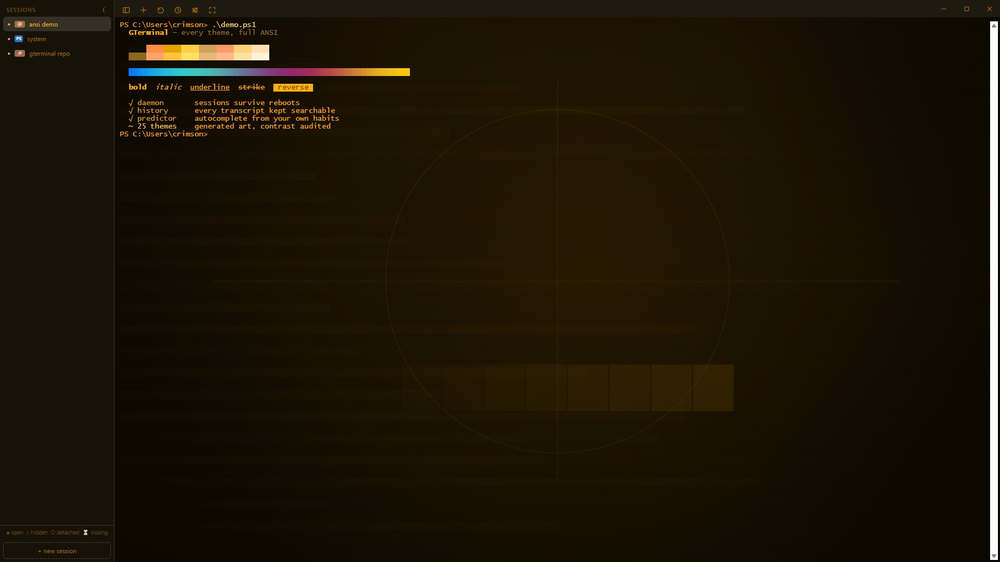
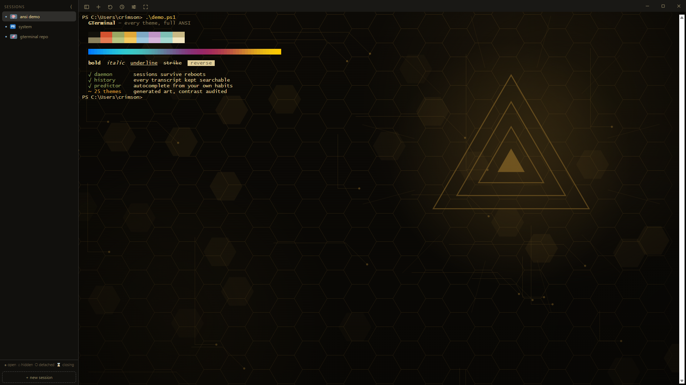
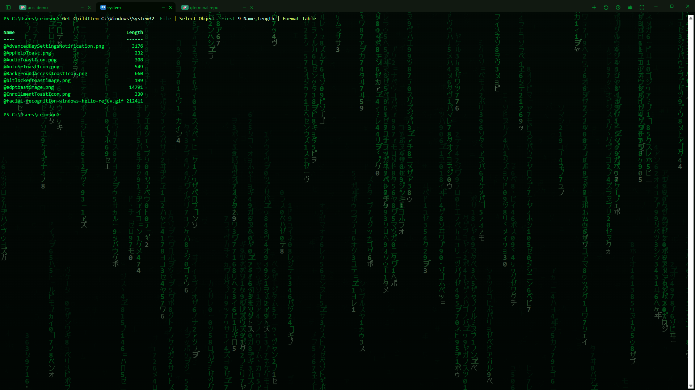
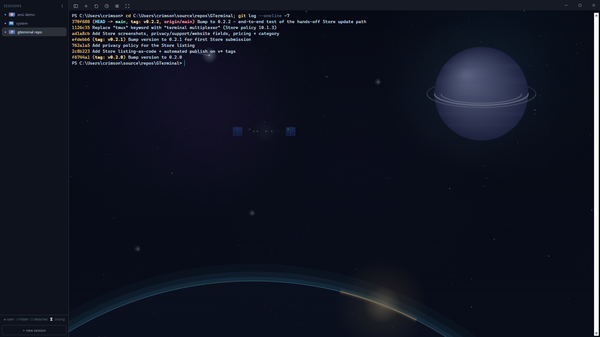
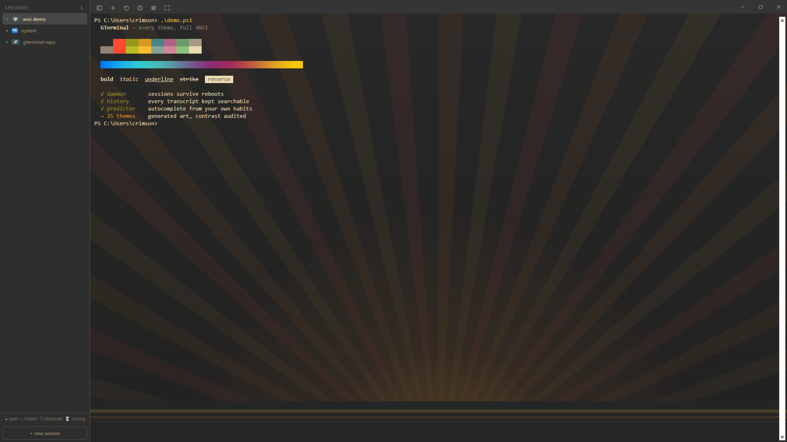

# GTerminal

A lightweight terminal for Windows with tmux-style session persistence: closing a tab, closing the window, or even rebooting doesn't lose your terminals.



<table>
  <tr>
    <td></td>
    <td></td>
  </tr>
  <tr>
    <td></td>
    <td></td>
  </tr>
</table>

Every theme is a complete look — 80 of them, from clean classics to full scene art. Browse the whole set in the [theme gallery](store-assets/theme-pool).

## How it works

- **UI**: [Tauri](https://tauri.app) (WebView2) + [xterm.js](https://xtermjs.org) with the WebGL renderer — far lighter than an Electron equivalent.
- **Sessions**: the same executable, launched as `gterminal --daemon`, owns every shell via ConPTY (`portable-pty`) and outlives the window. The UI is a thin client that attaches over a localhost socket and replays each session's scrollback ring buffer.
- **Reboot survival**: the daemon checkpoints every session (scrollback, working directory, running programs) to `%LOCALAPPDATA%\GTerminal\sessions` every few seconds. After a reboot, sessions come back "cold": a fresh shell in the saved directory with the old scrollback replayed behind a divider. If Claude Code was running in a session, `claude --continue` is pre-typed so a single Enter resumes the conversation.

## Behavior

| Action | Result |
| --- | --- |
| × / `Ctrl+Shift+W` (twice) | Close — session enters "Closing soon" with a countdown, restorable until the timer runs out, then dies |
| Close the window | All sessions keep running; next launch restores them |
| Reboot | Sessions restored cold: cwd + scrollback, fresh shell |
| `exit` in the shell | Session genuinely ends |
| ⟳ menu / `Ctrl+Shift+Z` | Restore (or kill) detached sessions |
| – / `Ctrl+Shift+H` | Park a tab as a pill in the bar; click to bring back |
| `Ctrl+Shift+B` | Toggle the session sidebar (all sessions: open/hidden/cold) |
| Double-click tab | Rename it (custom names stick) |
| Right-click tab | Context menu: rename, tab groups, hide/detach/kill |
| Right-click terminal | Menu: Copy (with selection), Paste, Select all |
| `Ctrl+Shift+T` | New tab |
| `Ctrl+Tab` · `Ctrl+Shift+Tab` | Next · previous tab |
| `Ctrl+1`…`Ctrl+8` · `Ctrl+9` | Jump to that tab · jump to the **last** tab, however many there are |
| `Ctrl+Shift+C` / `Ctrl+Shift+V` | Copy / paste |

Tabs shrink browser-style as they multiply; overflow collapses into a `+N` menu. Tabs can be organized into colored, collapsible groups (right-click a tab); groups and names persist across restarts and reboots. Tab icons show what's running inside (✳️ Claude Code, 🐍 python, 🦀 cargo, 🐳 docker, …).

**"Oops" grace window**: killing a session doesn't actually kill it — the tab closes but the process keeps running for 5 minutes (a ⌛ "closes in Xm" entry in the sidebar/menus restores it, cancelling the kill entirely). An accidental `exit` is likewise restorable from its checkpoint for the same window. Kill something twice to skip the grace. Configure with `%LOCALAPPDATA%\GTerminal\config.json`: `{"grace_minutes": 10}` (0 disables).

**Config** (`%LOCALAPPDATA%\GTerminal\config.json`, all keys optional):

```json
{
  "grace_minutes": 5,
  "cursor_style": "bar",
  "cursor_blink": true,
  "theme": "one-dark"
}
```

`cursor_style` is `bar` (default, Windows Terminal-like), `block`, or `underline`; `cursor_blink` defaults to true. Cursor settings apply to new windows/tabs.

**Settings** (⚙ button): theme, font family/size, line height, cursor style/blink, and the undo window — applied live and saved to `config.json`. Themes are a whole look, not just colors — 80 of them, each carrying its own font, line spacing, cursor personality, and backdrop art, individually overridable. The whole chrome (tab bar, sidebar, menus) recolors along with the terminal, and every theme is contrast-audited.

Sessions in their grace window get a dedicated **Closing soon** sidebar section with a live m:ss countdown; click to restore, × (twice) to kill immediately.

**Title suggestions**: right-click a tab → "Suggest title…" opens a picker with candidates computed locally from what's on the terminal — running program + folder, the last command you typed, directory paths, the shell's title. No network, always available. Optionally, configure an **AI endpoint** in ⚙ settings (blank = disabled, nothing is ever called): any Anthropic- or OpenAI-compatible base URL (hosted API, proxy, or local gateway like Ollama), with flavor, model ID, and optional key. With an endpoint set, the picker gains "✨ Ask AI for titles…" (five candidates to choose from), and an auto-titles toggle can quietly name unnamed tabs in the background. Manual renames always win.

## Development

Requires Rust (1.85+) and Node.

```sh
npm install
npm run tauri dev     # run against the vite dev server (live reload)
npm run app           # standalone debug build, UI baked in
npm run tauri build   # package installer
npm run test:typing   # typing correctness + echo latency regression test
```

`npm run tauri dev` and a plain `cargo build` both produce a binary that
loads its UI from the dev server on :1420 — editing `src/` reloads a
running window, and with no server up the window is blank. Use `npm run
app` for a binary that carries the frontend inside it: that is the one to
use day to day, and the one the visual tests need (`-Exe`).

`npm test` runs both suites against isolated daemons (scratch state dirs, never your real sessions):

- **typing**: burst-types a payload char-by-char and asserts intact arrival, then measures per-keystroke echo latency (budget p50 < 50ms / p95 < 150ms; typical p50 ≈ 1–2ms).
- **lifecycle**: create/attach, scrollback replay, cwd tracking, detach-keeps-alive, soft-kill grace + restore-cancels-kill, double-kill-is-hard, typed-exit-to-trash, trash resurrection, and full reboot survival (daemon force-killed, sessions restored cold with scrollback + cwd).

Every new feature should land with coverage in one of these suites.

`npm run coverage` measures what the tests actually reach and prints a
table per area (it also writes to the GitHub job summary in CI):

- **TypeScript** - c8 around every node suite. The extracted modules sit
  at ~99%; `main.ts` reads 0% because it is webview code exercised by the
  35 visual scenes, which no node-side tool can see. The report names it
  as not-measured-here rather than averaging it into something untrue.
- **Rust** - cargo-llvm-cov over the unit tests. The daemon and the Tauri
  command layer are exercised by `lifecycle.ps1`, `typing.ps1` and the
  visual scenes, and none of that is counted: running those suites under
  instrumentation was tried and measures nothing, because the daemon runs
  from a self-copy (`mux::daemon_binary`) that llvm-cov cannot attribute
  counters to. So a low number there means "not reachable from a unit
  test", which is not the same as untested.

There is deliberately no coverage threshold. The quickest way to raise a
combined number here would be shallow unit tests for code already covered
end to end - the report exists to be read, not to be passed.

`npm run test:mutate` is the other half of that: it breaks the code on
purpose and checks the guarding test fails. A test nobody has watched
fail is decoration.

## How it works

[docs/architecture.md](docs/architecture.md) — the two processes, the wire
between them, where session state lives, and what the test suites drive.
Deeper dives: [tiling panes](docs/tiling-panes.md),
[command blocks](docs/command-blocks.md), and
[the daemon outliving the app](docs/daemon-protocol.md).

## Known limitations

- The daemon socket is unauthenticated localhost TCP; switching to a user-ACL'd named pipe is the planned hardening step.
- Scrollback checkpoints are capped at 512KB per session and flushed every 3s, so a hard cut can lose the last few seconds.

**Shells**: PowerShell 7, Windows PowerShell, and Command Prompt. Set the default in ⚙ settings; right-click the + button (tab bar or sidebar) to open a one-off tab in a specific shell. Each session remembers its shell — reboot resurrection brings back the same one. All shells get cwd tracking (PowerShell via a prompt hook, cmd via its `$E]9;9;$P$E\` prompt escape).
