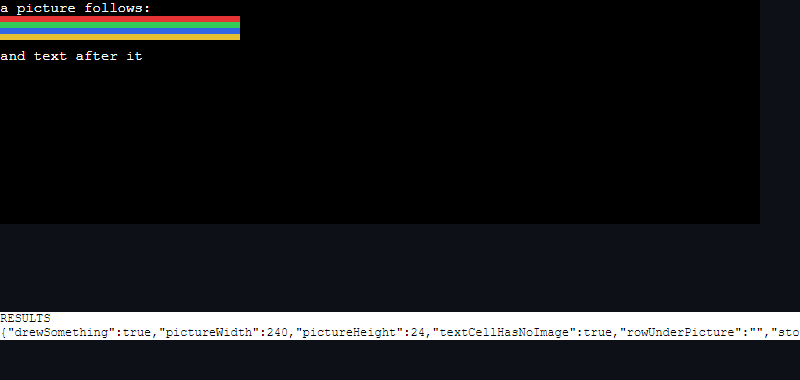

# Things this terminal does not do yet

Not a roadmap and not a wish list. Each entry says what is missing, why
it is worth doing *here* rather than in general, and what it would cost
— so that picking one up starts from an argument rather than from a
title. Entries leave this file when they ship or when the argument
stops holding; the second is a real outcome and should be written down
as one.

The order is the order they were argued in, which is roughly value per
unit of new machinery. It is not a queue — the numbers are names, so
that "do 5" means something, not positions in a plan. They stay with
their entry when the order changes and are not reused after one ships.

## Done

### 1. Inline images (sixel) — *built, and blocked below us*

The window draws them now: `@xterm/addon-image` is loaded before the
terminal is opened (it registers its DCS handler on activate, so one
loaded afterwards misses the picture — an hour, that), with a
per-tab budget in megabytes because decoded image data is RGBA and a
program in a loop is otherwise unbounded. The daemon refuses to keep
them, like it refuses what a full-screen program draws: a sixel is tens
or hundreds of kilobytes against a ring capped at 512KB, so one chart
would evict every line of text in the session.

**And none of it can be reached from a program today.** ConPTY parses
what a console program writes and re-emits its own stream, and it drops
DCS strings entirely. Measured, not assumed: `tests/fixtures/sixel.ps1`
run in a real session, reading what arrived at the window — the text
either side of the picture, and not one byte of the picture. The same
shape as the mouse-mode finding next to it, and less fixable: a program
can ask for mouse reporting by setting a console mode, and there is no
console mode that means "pass my pictures through".

That is the engine and the addon this app loads, given the bytes
directly — the picture `tests/fixtures/sixel.ps1` writes, which a
program cannot get here through ConPTY. Kept because "it draws them,
something else is in the way" is a claim worth being able to see.

And it is worse than absent while that holds, which is the part worth
knowing. The addon answers Primary Device Attributes with
`ESC[?62;4;9;22c` — the `4` is a claim to draw sixel — so a program
asks what the terminal can do, is told "pictures", sends one, and gets
nothing. Told "no", the same program prints its ASCII fallback. So
loading it turned a working fallback into an empty screen, and the
default is off until something can carry the reply.

So it ships inert, deliberately. `tests/images.mjs` proves our half
against the real engine, including the load order, so the day conhost
forwards DCS this works without anybody rediscovering how. Worth
revisiting if the daemon ever grows a path that is not ConPTY, or when
a Windows build starts passing them.

### 2. Say when a long command finishes — *done*

Off by default, thirty seconds by default, and silent while you are
looking at the window, because the prompt coming back has already said
it. Settings under Keyboard and input.

One thing the building of it settled: a command's start is taken from
the Enter that sent it, not from the prompt mark. The shell reports
when a command *finished* and when a prompt appeared, never when one
started, so timing from the prompt would count the minutes somebody
spent typing - and a two-second command typed slowly would arrive as a
long one. The cost is that a session driven from somewhere else, the
phone view included, has no start time and says nothing. That is the
right trade for now and worth revisiting if the daemon ever stamps the
input it writes.

### 3. Jump between prompts — *done, and it was half-built already*

Written up as "the blocks are parsed and nothing navigates them", which
was wrong: `prevPrompt`, `nextPrompt` and Ctrl+Shift+↑/↓ have been there
all along. Checking beat describing, again.

What was actually missing was the other half - walking back through the
commands that *failed*, which `failures()` could answer and nothing
asked. Ctrl+Shift+E now does it, wrapping from the oldest back to the
newest, and saying so when a scrollback holds no failures at all rather
than behaving like a key that is not bound.

## Argued for, not started

### 4. Open `src/main.ts:4821` from the output — *done*

`addon-web-links` matches URLs only, so every file-and-line in compiler
or test output is dead text. A link provider plus a configurable open
command. The payoff is daily for anybody reading build output; the work
is one provider and one setting, and the hard part is the pattern —
Windows paths, relative paths, and `path:line:col` all at once, without
turning ordinary prose into links.

Done. A link provider rather than the addon's regex, because a match is
only worth offering if the file is actually there - which needs the
shell's working directory and a trip to the filesystem, asked on hover.
The pattern is in `src/filelinks.ts` with the twenty-four cases that
pin it, half of them things that must *not* become links: a clock time
is three numbers and two colons, and this terminal prints one in its
own status bar.

Opened by a command from settings, split into a program and arguments
before the values are substituted - the other order tears a path with a
space in it into two arguments, which on Windows is anything under
"Program Files". A plain click activates it; Ctrl is not required, read
from xterm's activation path rather than remembered.

### 5. Copy on select — *done*

The other half of QuickEdit, and this app already offers the console's
right-button behaviour for people arriving from conhost. One setting.
Had it existed, the whole "I select and it disappears" thread would not
have happened.

Done, off by default. Fires when the selection *settles* rather than on
every change - xterm reports each cell a drag crosses, and writing the
clipboard forty times per gesture is forty chances to collide with
whatever else has it open. Selections made this way stay out of the
clipboard history, which would otherwise fill with the half-selections
a hand makes on the way to the one it wanted. A scene drags with the
setting off and then on, because either half alone passes for the
wrong reason.

### 7. Find, properly — *done, and the entry was mostly wrong*

Written up as "no regex, no case toggle, and nothing searches the
transcripts". Two of those already existed and the third was half true:
the history page did search transcript text, it just returned the
*session* - a wall of output somebody then searched again by eye.
Checking beat describing, for the second time on this list.

What was actually missing: a whole-word toggle in the find bar, and
*where* in a transcript a history search landed. The history page now
lists the matching lines under each session, with line numbers and the
match highlighted, capped at eight per session because a transcript
that mentions the word four hundred times is one result with noise in
it. Clicking a line opens the transcript with the search already primed
so the viewer lands on it. Matching is case-insensitive and stays that
way: "did I see this last week" is not a question anybody asks with the
case they saw it in.

### 8. Export a block or a session — *done, for sessions*

Transcripts are kept and can be read back. Getting one *out* — as text,
or as HTML with the colours intact — is a small addition on top, and the
thing anybody does with a failure they want to show someone else.

Done for whole transcripts: two buttons in the history viewer, text
with every escape removed and HTML with the colours kept. The HTML side
is a small renderer that keeps colour and weight and steps over
everything else - nobody wants a cursor-accurate replay of their build
in a browser, they want to read it - and treats a bare carriage return
as "replace the line", so a progress bar exports as its last frame
rather than all of them. Palette chosen to read on a white page as well
as a dark one, because a file is opened where the theme does not follow.

Not done: exporting one *block*. The pane menu already copies a block's
text; saving it as a file is the same thing with a dialog in front, and
was not worth its own button until somebody asks for it.

### 9. Auto-run a command in a new shell — *done*

Offered once and never built: a `command` field on a session template,
delivered through the daemon's `pending_input` so it lands after the
first prompt rather than into a shell that is still starting.

Done. A "Run on open" field on each template; the daemon holds the
command until the prompt hook reports a cwd and then executes it - not
pre-types it, because a command sitting at a prompt is one keystroke
from either running or being erased, which is worse than either. The
lifecycle test waits for the marker to appear *twice*, echoed and then
printed, since once means typed and never run.

### 12. Shell integration for cmd and WSL — *done; WSL tested on a real distro*

cmd got the cwd and nothing else, so no command blocks, no
jump-to-failure and no finish notification in a cmd tab - every one of
those looked like a feature that worked in one shell. Its prompt string
carries the rest now: A before the prompt, 9;9 with the folder, B where
typing starts, and D at the start of the next prompt. Six lifecycle
checks read the bytes off a real cmd session.

The one thing it cannot carry is an exit code - cmd's prompt has no
escape for ERRORLEVEL - so D goes out bare. blocks.ts already treats a
bare D as "unknown" rather than as success, which is why that rule was
written the way it was.

WSL is a shell option now, carrying the same marks. It was first built
blind - no WSL on the build machine - through BASH_ENV, and that was
wrong: **BASH_ENV is read only by non-interactive bash**, so an
interactive login sourced it never and emitted no marks at all. A
Windows sandbox with a real WSL2 Ubuntu proved it (all marks false) and
proved the fix: `bash --rcfile <file>`, where the file sources the
user's own ~/.bashrc first - untouched - then appends the marks, the
same "wrap, do not replace" the PowerShell hook does. --rcfile does not
also read ~/.bashrc, so sourcing it explicitly is what keeps the user's
shell. The rcfile rides in by value as base64 through `wsl.exe -- bash
-c`, so no distro is named and no Windows→WSL path has to be translated.
On the real distro every mark arrives, the exit code comes with the D
(cmd cannot manage that), and a custom PS1/PROMPT_COMMAND survives. The
sandbox procedure and results are checked in at tests/wsl-rcfile.md;
`cargo test wsl_boot` guards the mechanism on CI without needing WSL.

### 13. Search every open tab — *done*

The history page's search now lists the tabs that are open first,
under their own heading, with the same numbered hits the ended sessions
get. Clicking a hit switches to the tab and scrolls to the line - the
tab is live, so it can be scrolled to rather than searched again.

Two things it found on the way. Opening the history page left focus
in the terminal, so the first thing typed on a page that is about
searching went into the shell; it focuses its search box now, as
settings does. And the transcript search read every PSReadLine repaint
as its own line, turning one command into a smear of half-typed copies
in the results; a bare carriage return is now read as "the line so far
is replaced", which is what the screen showed.

### 16. Does a session survive the app crashing, not just rebooting — *yes, measured*

Every restore scene tested the reboot - kill the app and the daemon
together, start again on the same state. Nobody had tested the other
case, the app dying and the daemon not, and it is the one that happens
more: a window crashes far more often than Windows does.

The part worth worrying about was not whether the shell survives (the
daemon owns it) but whether the *next* window can take it. The daemon
permits one attacher, and a fresh window refuses to adopt a session
another window already has - so a crashed window's attachment
lingering would make the next launch see every session as "open
elsewhere" and offer to restore nothing, which looks exactly like the
crash having lost them.

It does not linger. The lifecycle suite now kills the client socket
with no detach, which is what a dead process looks like to the daemon,
and times how long until the session reads as free: **under a
quarter-second**. The shell is still running, the scrollback is
intact, and a new attach gets the replay. Windows closes a dead
process's sockets, the daemon's read loop ends, the attachment is
released in the cleanup that follows - the path that was there all
along, now proven rather than assumed.

## Known and deliberate

### 11. The daemon socket — *the hole is closed; the pipe is not built*

Unauthenticated localhost TCP, which was defensible while only the
window spoke to it. Remote control changes the shape of that: the daemon
is now what sits behind a network-facing server, and anything else
running as this user can drive a shell through it. The README has
listed the named-pipe hardening as the planned step for some time; it
has more weight behind it now than when it was written.

Done differently, for now. Every connection presents a 160-bit token
read from `daemon.token` in the state directory, checked once per
connection — so reaching the daemon means being able to read this
user's profile, which is the same bar the pipe ACL would set, and the
sandboxed-process case that loopback TCP let through is closed. The
token rides on the first request rather than a line of its own, because
a hello line is answered "bad request" by a daemon from before the rule
and a freshly updated window would fail to retire the old daemon
holding all the sessions.

What is still worth doing: the pipe itself, which would make the check
structural rather than something every client has to remember. The
remaining gap is a process running as this user that has no business
driving a shell — for which a file it can read is no barrier.

## Argued, and set down

### 6. Broadcast input to several panes — set down

Splits exist; typing the same thing into each is manual, and tmux
(synchronize-panes) and Windows Terminal both do it. Set down because the
split here is for *watching* several things run, not driving them in
lockstep — and a mode that sends one keystroke into every live shell is a
footgun with a narrow upside: the day it saves you typing one command
into four shells is outnumbered by the day it runs the wrong one in all
four. Not worth the mode, and the guardrails it would need, until
something asks for it far more loudly than anything has.

### 10. A screen-reader mode — set down, not against

xterm has one and nothing exposes it, so it looked like a checkbox and a
line of settings text. That is the trap: exposing the flag is not the
same as a terminal that actually reads well, and shipping the toggle
would claim an accessibility feature without having sat with a real
screen reader to know it delivers one. Better built properly — and tested
against an actual reader — the day someone needs it, than shipped on
faith as a tickbox. The door stays open; this is "not yet, and not like
this", not "no".

### 17. Remote terminals — a tab on another machine

The ask was two things wearing one name: a tab that is a shell *on*
another box — `ssh user@host`, or PowerShell's `Enter-PSSession` over
WinRM or over SSH — and a tab that attaches to *another GTerminal's*
running sessions, the same ones its own window is showing.

Both are cheaper than they look, which is what made them tempting. The
shell half is nearly free: a session template already carries a run-on-
open command (idea 9), delivered after the first prompt, so a connection
is just a template whose command is `ssh …`. Nothing new in the daemon,
and a property worth having falls out — the local shell it launched from
is a harbour, so when the remote drops you land back at a working prompt
instead of a dead tab. The GTerminal-to-GTerminal half is cheap where it
counts too: the trust is already built. The far window runs the remote-
control server (the phone view's server), and the approve-on-desktop
pairing shipped with it — a device with no token asks, a code shows on
the desktop, approval hands back the token. Machine to machine is the
same handshake with a native client in the phone's place; not a line of
new auth.

So the machinery is small. We set it down anyway, on the question the
machinery does not answer: **how does anyone tell a remote pane from a
local one?** A connection is not really a launcher — it is an identity,
and until that identity is carried everywhere the session shows its face
(the tab, a strip across the top of the pane, the sidebar row, the status
bar), with local staying plain and only remote lit, the feature's net
effect is to make it easy to lose track of which machine a keystroke
lands on. That is the one mistake a terminal must never make cheap, and
shipping the easy half — the launcher — without the identity makes it
cheaper, not dearer. The cheap half is the trap.

The launcher placement was a smaller cut of the same worry. Inline in the
new-tab `+` menu, "open a shell here" and "go to another machine" read as
one action, and that menu already carries templates, elevated, and the
raw shells. And the harbour muddies the very signal it would need: an ssh
tab is local, then remote, then local again on `exit`, and the app has no
live read of which — the prompt hook that reports the folder stops at the
ssh boundary, so "am I home?" would be a guess until that hook learns to
report the hostname too.

What it would take to pick this up is therefore not the ssh command —
that is an afternoon — but the identity, worked out first: a colour and a
name a connection wears on its tab and its pane and every list it appears
in; the prompt hook taught to carry the host so remote-versus-local is
live rather than assumed; and a home for connections that is not the `+`
menu. The argument to build it does not hold yet. Revisit when someone is
driving a second machine often enough to pay for being sure, at a glance,
which one they are typing into.
